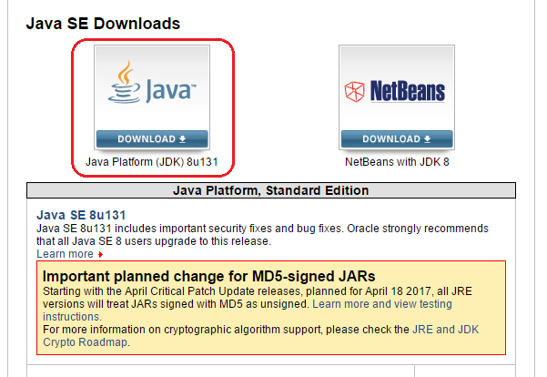
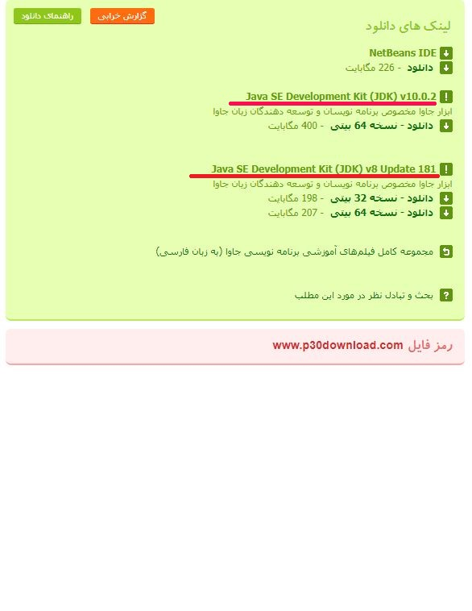
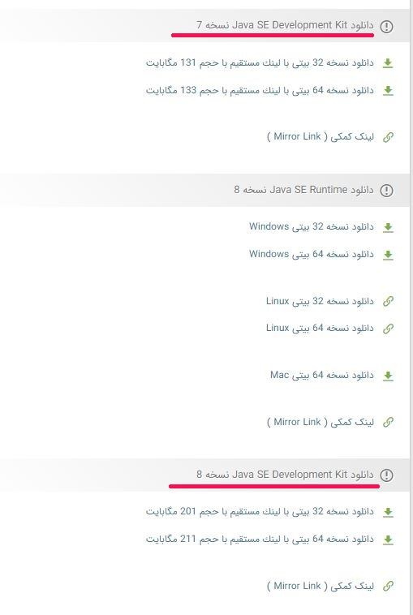
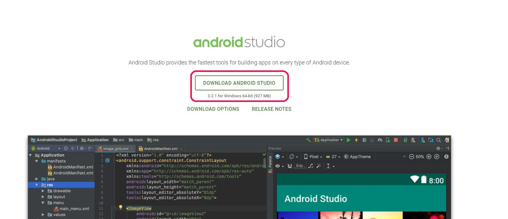
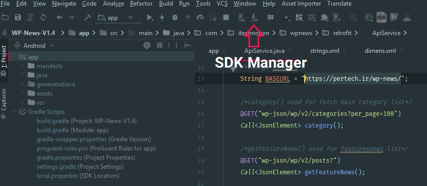
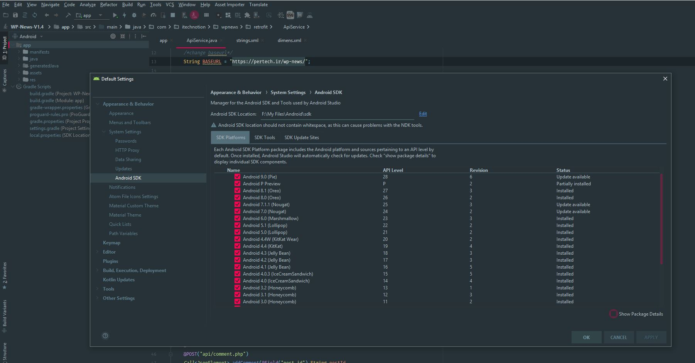

# تنظیمات و  نصب نرم افزار اندروید

## قبل از اینکه تو شروع کنی

* اسناد کنونی برای کمک به شما در نصب سریع و پیکربندی برنامه WP News ایجاد شده است. لطفا دقت آن را بخوانید تا از بسیاری از مشکلات بالقوه پیکربندی نادرست جلوگیری شود.
* در زیر فصل نحوه نصب Android SDK و Android Studio را توضیح می دهد. شما لازم نیست برای نصب اندیشه استودیو، اما بهتر است. این پروژه را می توان بدون آندروید استودیو، با استفاده از Gradle و اندروید SDK ساخته شده است. Gradle یک سیستم ساخت است که برای ساخت فایل APK نهایی استفاده می شود.
* پس از فعال شدن موضوع، شما باید برخی از صفحات و تنظیمات را برای عملکرد مطلوب تغییر دهید. به همین دلیل، لطفا با مرکز پشتیبانی از قبل تماس نگیرید. ابتدا اسناد را بخوانید، تمام مراحل زیر دستورالعمل ها را اجرا کنید و فقط پس از آن، اگر مسائل همچنان ادامه دارد، با ما تماس بگیرید.

## دانلود و نصب جاوا 


### اگر نرم افزار جاوا را دانلود و نصب کرده اید به صفحه بعد بروید.


   دانلود نرم افزار [Java JDK](http://www.oracle.com/technetwork/java/javase/downloads/index.html)   

اگر نمی توانید به سایت Oracle وارد شوید از سایت های ایرانی دانلود کنید!!! 


حتما نسخه  **Java SE Development Kit** را دانلود کنید. نسخه 7 یا 8 فرقی نمیکند برای شما.


### دانلود از سایت **پی سی دانلود**

[www.p30download.com](http://p30download.com/fa/entry/33429/)

### دانلود از سایت سافت 98 

[www.soft98.ir](https://soft98.ir/software/692-sun-java-se-runtime-environment.html)

## نصب اندروید استودیو  Android Studio 


سایت اندروید استودیو برای کاربران ایرانی قابل مشاهده نیست. گوگل کاربران ایرانی را تحریم کرده. **گوگل هم برای ما شاخ شده خدا!!!!!!!**





دانلود از سایت اندروید استودیو 



  
دانلود از soft98.ir



  
دانلود از P30Download.com






برای دانلود SDK ها باید خود اندروید استودیو رو نصب کنید و از قسمت تنظیمات&gt; اندروید SDK آنها را دانلود کنید.



اگر دانلود آنها برای شما مقدور نیست میتوانید از سایت های ایرانی آنها را دانلود کنید البته چون آنها فایل های آپلودی میباشد. با نسخه های جدید فرق میکنند و شما دوباره باید آنها را دانلود کنید. به نظر بنده از خود اندروید استودیو دانلود کنید.


حتما پکیج های  Android SDK Tools، Android SDK Platform-tools،  Android SDK Build-tools, Android Support Repository, Android Support Library و Google Play services را نصب کنید. 



**اکنون شما باید بتوانید پروژه اندروید را باز کنید و ویرایش کنید و فایل APK را ایجاد کنید.**

