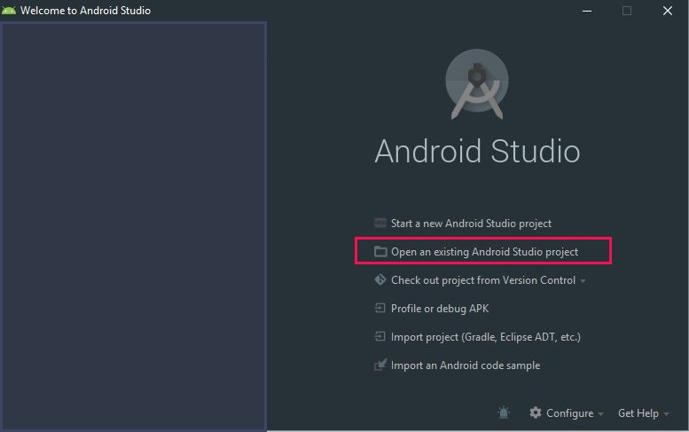
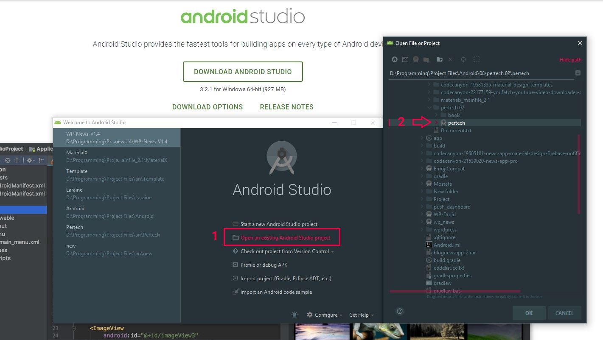

# نصب و راه اندازی

## قبل از شروع **لطفا توجه کنید**!!!


اسناد کنونی برای کمک به شما در نصب سریع و پیکربندی برنامه WP PerTech ایجاد شده است. لطفا با دقت آنها را بخوانید تا از بسیاری از مشکلات بالقوه پیکربندی نادرست جلوگیری شود.


## **نحوه وارد کردن پروژه:**

#### برای وارد کردن پروژه شما باید از استودیو اندرویدی که از قبل دانلود کرده اید شروع کنید. پس از آپدیت استودیو اندرویدی، مراحل زیر را برای وارد کردن پروژه در استودیو اندروید دنبال کنید.

## قسمت اول: روی گزینه Open existing android studio project کلیک کنید.

## قسمت دوم: پیدا کردن فایل پروژه

مکان یا آدرس فایل را کپی کنید و در قسمت آدرس وارد کنید. اینطور به راحتی بدون گیج شدن اندروید استودیو فایل رو پیدا میکنه.

